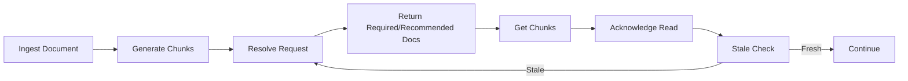

# Blueprint

## 1. Problem Statement

- **誰の**: AIエージェント基盤を設計・実装する開発者、workflow-cookbookを参照して実装を行うAIエージェント
- **何の課題**: 参照すべきファイルを読まずに進行、読んでも更新差分を追従できない、taskやBirdseyeが更新対象でも契約として保持できていない
- **なぜ今**: 長文資料を毎回食わせる運用はトークンコストと認識ブレの両面で不利

## 2. Scope

### In:
- Markdown文書を登録する仕組み
- 文書をchunk化して保持する仕組み
- feature名、task名、topicから文書を解決するAPI
- 必要chunkを取得するAPI
- 読了記録をtask側に残すための連携面
- 文書versionの差分に基づくstale判定
- Skillから呼びやすい薄いAPI surface

### Out:
- 文書本文の高度な編集UI
- 汎用CMS化
- 完全自動の意味差分判定
- 外部SaaSへの本格同期ロジック
- エージェント本体のorchestration全体

## 3. Constraints / Assumptions

- 時間: MVP期間は2週間程度
- 依存: memx-core, agent-taskstate, workflow-cookbook
- 互換性: 既存CLI/API/Skillとの統合が容易
- データベース: SQLite

## 4. I/O Contract

### Input:
- **docs:ingest**: doc_type, title, source_path, version, tags, feature_keys, body, chunking
- **docs:resolve**: feature, task_id, topic, limit
- **chunks:get**: doc_id, chunk_ids, query, heading, limit
- **reads:ack**: task_id, doc_id, version, chunk_ids, reader
- **docs:stale-check**: task_id
- **contracts:resolve**: feature, task_id

### Output:
- **docs:ingest**: doc_id, version, chunk_count, status
- **docs:resolve**: required[], recommended[], reason, version, top_chunks
- **chunks:get**: doc_id, chunks[]
- **reads:ack**: status, task_id, doc_id, version
- **docs:stale-check**: task_id, status, stale_reasons[]
- **contracts:resolve**: required_docs[], acceptance_criteria[], forbidden_patterns[], definition_of_done[]

## 5. Minimal Flow

## 6. Interfaces

### CLI:
- `mem in docs --title "..." --body "..." --doc-type spec`
- `mem out resolve --feature memory-import`
- `mem out chunks --doc-id doc:spec:memory-import`

### API:
- `POST /v1/docs:ingest`
- `POST /v1/docs:resolve`
- `POST /v1/chunks:get`
- `POST /v1/docs:search`
- `POST /v1/reads:ack`
- `POST /v1/docs:stale-check`
- `POST /v1/contracts:resolve`

### Skills:
- `/resolve-docs`
- `/read-chunks`
- `/ack-docs`
- `/stale-check`
- `/resolve-contract`